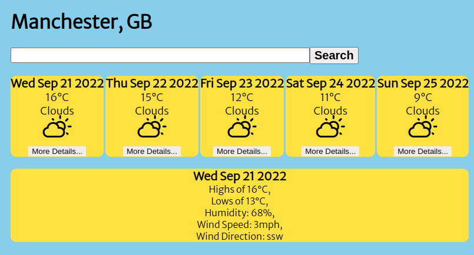
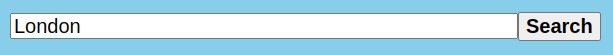
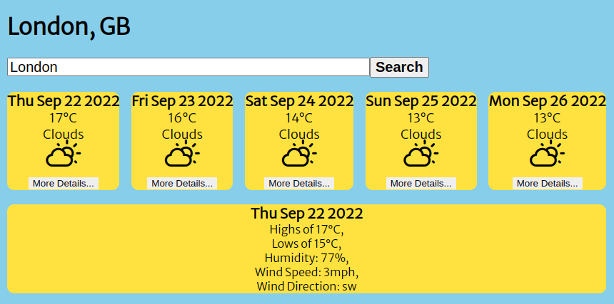
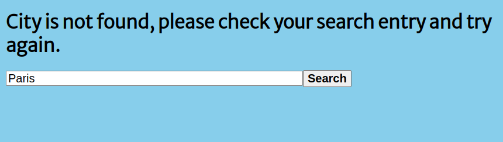

# Weather App 
A 5-Day Forecast of any City in Great-Britian right at your fingertips! All you have to do is enter the city of your choosing into the search bar, click "Search" and voila! The display will show you the forecast for the next 5 days.

Should you wish to see further details of the weather, such as wind speed and direction, you can! Just click on the "More Details..." button at the bottom of your choice of day and the information will appear.

The app will tell you:
- The day, date, month and year,
- Maximum and Minimum temperatures,
- Humidity,
- Wind Speed and Direction,
- And an image depicting the day's weather.

----------------
 ### Installation Instructions
1. Run `gh repo clone SuzBarnes/weather-app` into the console.
2. `cd` into the new directory
3. Run `npm install`
----------------
### Useful Commands:
|How to...| Command  | Further Details|
|---------|----------|----------------|
|Start the app|`npm start`|it will load on localhost:3000|
|Test| `npm test`| the tests will take place and any errors will be displayed in your console|
|Format| `npx prettier --write .`| Prettier is the ESLint tool used to help with formatting of the App
----------------
### How to use:
1. Use the search bar to enter a location in Great Britian

2. Click the "Search" button

3. The 5 day forecast will appear with the location at the top of the screen,
4. To find more information, click the "More Details..." button on the day of your choice

5. If the location isn't found, check your spelling/make sure the city is in Great Britian and search again.

----------------
### Technologies
- Created by bootstrapping the Create React App (https://github.com/facebook/create-react-app).
- Uses JavaScript, JSX, CSS.
----------------
### Further time
If I had further time I would have loved to:
- add the relevant city image to the background when searched to make it more interactive, 
- add day mode and night mode,
- written further tests,
- obtained forecast details worldwide, not just in GB.

Created by Suzannah  Barnes 2022
