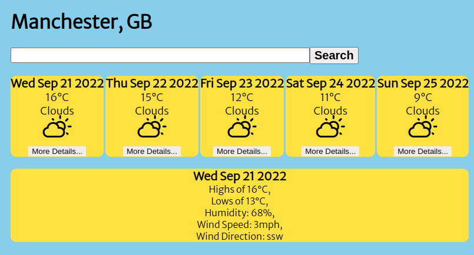

*Weather App*

A 5-Day Forecast of any City in Great-Britian right at your fingertips! All you have to do is enter the city of your choosing into the search bar, click "Search" and voila! The display will show you the forecast for the next 5 days.

Should you wish to see further details of the weather, such as wind speed and direction, you can! Just click on the "More Details..." button at the bottom of your choice of day and the information will appear.

The app will tell you:
- The day, date, month and year,
- Maximum and Minimum temperatures,
- Humidity,
- Wind Speed and Direction,
- And an image depicting the day's weather.

*Starting the App!*
- The Weather App can run by typing npm start into the console and it will load on localhost:3000

*Technologies*
- Created by bootstrapping the Create React App (https://github.com/facebook/create-react-app).
- Uses JavaScript, JSX, CSS.
- npm test will test the components
- Prettier is the ESLint tool used, npx prettier --write . has helped with the formatting.

*Further time*
If I had further time I would have loved to:
- add the relevant city image to the background when searched to make it more interactive, 
- add day mode and night mode,
- written further tests,
- obtained forecast details worldwide, not just in GB.

Created by Suzannah  Barnes 2022
